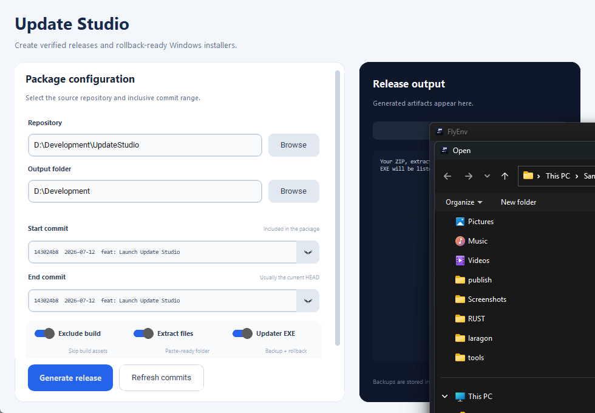

# Update Studio

Update Studio is a Windows desktop tool for creating deployment packages from
an inclusive Git commit range. It can also generate a self-contained updater
EXE that backs up affected files, installs the update, and supports rollback.



## Features

- Browse up to 500 recent commits and select an inclusive start/end range.
- Export exact committed file versions rather than dirty working-tree copies.
- Optionally include the complete current `public/build` directory, even when
  it is ignored by Git.
- Produce a verified ZIP, paste-ready extracted folder, and deletion manifest.
- Generate a self-contained Windows updater EXE with an embedded payload.
- Let the operator choose the deployed application directory at install time.
- Back up every file that will be replaced or deleted before applying changes.
- Restore automatically if installation fails and support manual latest-update
  rollback.
- Reject paths that attempt to escape the selected installation directory.

## Download

Download `UpdateStudio.exe` from the latest GitHub release. Place it inside or
below the Git repository you want to package, then run it.

## Running from source

Requirements:

- Windows 10 or Windows 11
- Python 3.11+
- Git available on `PATH`

```powershell
git clone https://github.com/JawadYzbk/update-studio.git
cd update-studio
python -m pip install -r requirements.txt
python update_package_gui.py
```

You can also double-click `launch.bat`.

## Creating a package

1. Choose a Git repository.
2. Choose the output directory.
3. Select the first commit. This commit is included.
4. Select the end commit, normally `HEAD`.
5. Configure the outputs:
   - **Exclude build:** omit `public/build`.
   - **Extract files:** create a folder ready to paste into deployment.
   - **Updater EXE:** create a self-contained graphical updater.
6. Select **Generate release**.

When **Exclude build** is disabled, Update Studio appends every current file
under `public/build` to the package. This is intentional because build outputs
are commonly ignored by Git.

## Updater and rollback behavior

The generated updater asks for the root installation directory. Before making
changes, it creates:

```text
<installation>/.update_backups/<package-id>/
```

The backup records whether every affected path existed and copies its original
contents when present. New files, replaced files, and deleted files can
therefore all be reversed. If applying the payload fails, rollback runs
automatically. **Rollback latest** restores the most recent retained backup.

Keep database migrations and other application-level deployment steps in your
normal deployment procedure; Update Studio manages files only.

## Building the Windows executable

```powershell
build.bat
```

The executable is written to `dist\UpdateStudio.exe`.

## Tests

```powershell
python -m unittest discover -s tests -v
```

The tests cover inclusive commit ranges, deleted-file manifests, ignored build
assets, backup creation, update application, and rollback.

## Security model

- Files are sourced from the selected Git commit, except an explicitly included
  working-tree `public/build` directory.
- ZIP contents are verified against the selected file list.
- Installation and rollback paths are resolved and checked to remain within the
  chosen installation root.
- Existing files are backed up before the first deployment mutation.
- Package creation never modifies the source repository.

## License

[MIT](LICENSE)
